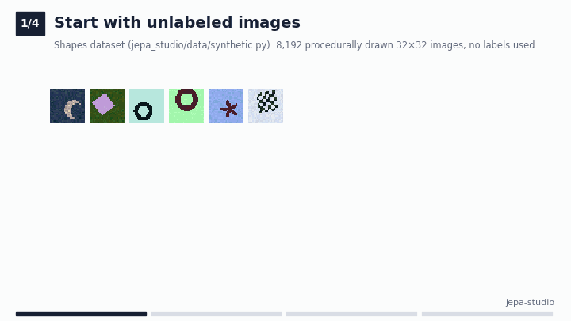
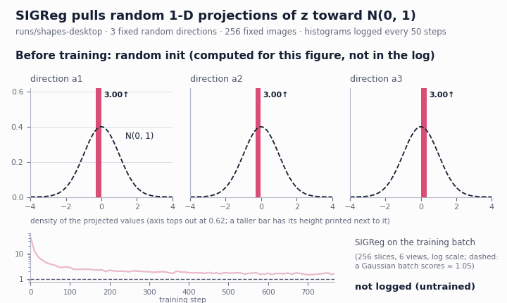
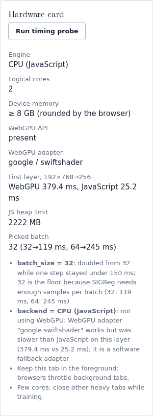
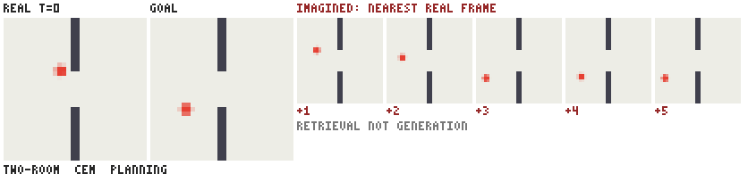
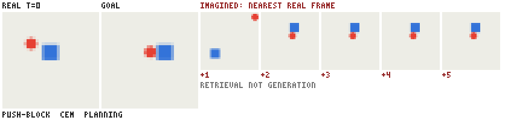

<p align="center">
  
</p>

# jepa-studio

**Pretrain, inspect and use LeJEPA models on your own unlabeled images, video or time series,
then drive a planning bot inside a learned latent world model.** See it, run it, trust it.

[](https://github.com/Normansrule/jepa-studio/actions/workflows/ci.yml)
[](https://github.com/Normansrule/jepa-studio/actions/workflows/pages.yml)
[](LICENSE)
[](https://securityscorecards.dev/viewer/?uri=github.com/Normansrule/jepa-studio)

LeJEPA is a Joint-Embedding Predictive Architecture (JEPA) trained with Sketched Isotropic
Gaussian Regularization (SIGReg): one loss, one knob, no teacher network, no tricks
([Balestriero & LeCun, 2025](https://arxiv.org/abs/2511.08544)). jepa-studio wraps it in an app
that shows every step (views, loss terms, embedding cloud, collapse check, probes, planning),
runs on whatever machine you have, and writes down every number and decision so you can check
them.

### ▶ [Try it in your browser](https://normansrule.github.io/jepa-studio/app.html)

No install, nothing uploaded: a small LeJEPA model trains inside the tab
([what the web demo does](docs/web-demo.md)). For real models on your own files, use the Python
package or the desktop app ([docs/desktop.md](docs/desktop.md)).

---

## Quickstart (Python)

Python ≥ 3.10. PyTorch comes from PyPI; for a CPU-only machine you can install the smaller CPU
build first with `pip install torch torchvision --index-url https://download.pytorch.org/whl/cpu`.

```bash
git clone https://github.com/Normansrule/jepa-studio && cd jepa-studio
python -m venv .venv && source .venv/bin/activate     # Windows: .venv\Scripts\activate
pip install -e .                                      # extras: ".[video]", ".[assistant]", ".[dev]"

jepa-studio doctor                                    # check the install
jepa-studio hardware                                  # hardware card + the settings it would pick
jepa-studio train --name shapes --epochs 2 --run-dir runs/my-shapes --eval
jepa-studio inspect --run-dir runs/my-shapes          # isotropy + collapse verdict
jepa-studio export  --run-dir runs/my-shapes          # HTML report + reproducibility bundle
jepa-studio world   --env two-room --out runs/my-two-room   # train a world model + planning bot
jepa-studio ask "why does SIGReg prevent collapse"    # search the docs (extractive answers)
```

The built-in dataset ("Shapes": 10 procedurally drawn classes) needs no download. For your own
data: `jepa-studio train --kind images --data ~/photos --name photos` (see [docs/data.md](docs/data.md)).

Every command (`jepa-studio <command> --help`):

| Command | What it does |
|---|---|
| `hardware` | benchmark this machine and show recommended settings (`--json`, `--no-disk`) |
| `train` | LeJEPA pretraining (`--config`, `--data`, `--kind`, `--name`, `--epochs`, `--mode`, `--run-dir`, `--runs`, `--fresh`, `--eval`) |
| `eval` | linear probe + k-nearest-neighbor (kNN) + baselines for a run |
| `inspect` | isotropy and collapse report |
| `bench` | measure samples/s as each automatic optimization is switched on |
| `world` | train a world model and evaluate the planning bot (`--env two-room\|push-block`) |
| `serve` | local backend for the desktop app (127.0.0.1 only) |
| `export` | run report + reproducibility bundle (`--onnx` also writes `encoder.onnx` for image encoders) |
| `verify-bundle` | check an unpacked bundle against its manifest |
| `keygen`, `sign-weights`, `verify-weights` | Ed25519-signed SHA-256 manifests for weight folders |
| `import-legacy` | convert a `.pt`/`.pth` to safetensors (weights-only, explicit) |
| `ask` | ask the docs (retrieval; optional local model) |
| `doctor` | check the installation |

## The seven tabs

The web app and the desktop app share one front end (`site/`).

| Tab | What you do there | Screenshot |
|---|---|---|
| **Data** | Pick Shapes, or choose, drag and drop or paste your own images (a whole folder works) or a CSV; see one input next to the global and local views the model will train on. | [tab-data](assets/screens/tab-data.png) |
| **Train** | Pick a preset (Quick look, Balanced, Thorough) or set steps, λ, learning rate and SIGReg directions, each with a precise number box, inline checks against the config schema and a help link; watch the total loss, the prediction term and the SIGReg term live, with a health check and the hardware card. | [tab-train](assets/screens/tab-train.png) |
| **Inspect** | Explore the embedding cloud in 3-D or 2-D (principal components), read the collapse detector, browse nearest neighbours and saliency maps (plus [CLS] attention maps for ViT-tiny runs in the desktop app), and replay "projections turn Gaussian". | [tab-inspect](assets/screens/tab-inspect.png) |
| **Evaluate** | Freeze the encoder; fit a linear probe and a kNN classifier on a few labels; compare with a random-init and a supervised baseline. | [tab-evaluate](assets/screens/tab-evaluate.png) |
| **World model** | Pick an environment and a goal; the Cross-Entropy Method (CEM) planner imagines in latent space, acts, replans; compare with random actions. | [tab-world](assets/screens/tab-world.png) |
| **Explain** | Optional, off by default. Ask how something works; answers are passages quoted from these docs and your run log, with links. In the browser nothing is generated; the desktop can optionally phrase answers with an offline local model. | [tab-explain](assets/screens/tab-explain.png) |
| **Export** | Download embeddings (CSV/`.npy`), weights (safetensors), the run report or a reproducibility bundle; view, edit, validate and apply the run config as JSON. | [tab-export](assets/screens/tab-export.png) |

Also in `assets/screens/`: [landing.png](assets/screens/landing.png),
[landing-dark.png](assets/screens/landing-dark.png) and
[hardware-card.png](assets/screens/hardware-card.png).

## Web or desktop?


| | Web demo (browser tab) | Desktop app / Python package |
|---|---|---|
| Install | none | `pip install -e .`, or the desktop app with one-click setup ([desktop.md](docs/desktop.md)) |
| Compute | JavaScript; WebGPU for the first layer's two big matrix products, only when verified correct and faster | PyTorch on CPU, CUDA, ROCm or Apple MPS |
| Encoders | `mlp-tiny` (218 512 parameters, 16 × 16 inputs) | `convnet-tiny`, `convnet-small`, `vit-tiny`, `mlp-tiny`, `video-convnet`, `series-conv` |
| Data | Shapes, local images (≤ 2000), CSV preview | images, video clips, time series (CSV/TSV/NPY), Shapes |
| Hardware tuning | timing probe for batch size | full hardware card, automatic precision / workers / threads / batch size, modes, thermal pause |
| Pause / resume | in the tab, while it stays open; no checkpoints on disk | checkpoints on disk (safetensors), pause / stop / resume across restarts |
| World model | plans with the shipped models | trains new models and plans |
| Explain | BM25 over the docs | BM25, plus an optional offline local model |
| Your files | decoded in the page, never uploaded | read from folders you grant |

## How LeJEPA works, in five sentences



1. An encoder turns several augmented views (crops) of the same input into embeddings, and a
   small projector maps them into the space where the loss is computed.
2. The prediction term asks every view's embedding to match the average embedding of the
   input's *global* views, so the model learns what stays the same across views; it predicts in
   embedding space, not pixels.
3. On its own that is solved by mapping everything to one point, so SIGReg projects each batch of
   embeddings onto random directions and uses the Epps–Pulley test to penalise any projection
   that doesn't look like a standard normal $\mathcal{N}(0, 1)$.
4. If every 1-D projection is standard normal, the whole cloud is the isotropic Gaussian
   $\mathcal{N}(0, I)$ (Cramér–Wold), which the paper argues is the best shape for whatever
   probe you fit later.
5. The loss is $(1-\lambda)\,\mathcal{L}_{\text{pred}} + \lambda\,\mathcal{L}_{\text{SIGReg}}$: one knob,
   and no Exponential Moving Average (EMA) teacher, stop-gradient, negative pairs or decoder.

| SIGReg at work | Predict embeddings, not pixels |
|---|---|
|  |  |

Every equation, exactly as coded, with worked examples that a test re-checks:
[docs/equations.md](docs/equations.md).

## Hardware auto-tuning



Before training, jepa-studio probes the machine (CPU, RAM, GPU and its bf16/fp16 support, disk
speed, temperature sensors) and picks precision, channels-last, data workers, threads and the
largest batch size that fits under 85% of memory, **writing each choice and its reason** into
`hardware.json`. Three modes (max, balanced, quiet) trade speed for a cooler, quieter machine,
and training pauses itself if a sensor passes 85 °C. `jepa-studio bench` measures what each
setting actually buys on your machine:


Honest result on the machine in the figure (a 2-core CPU with no GPU,
`assets/throughput-benchmark.json`, median of 3 runs): baseline 202.5 samples/s, with batch 128
199.7, plus one loader worker 195.3. **On a small CPU the tuner's choices are speed-neutral**
(the three runs overlap); the settings that matter (bf16, channels-last, pinned memory, more
workers) only switch on with a GPU, and we have no GPU measurement in this repo yet.
Details: [docs/hardware.md](docs/hardware.md).

<br clear="right">

## The planning bot

A JEPA world model learns to predict the next frame's *embedding* from the current one and an
action (trained end-to-end from pixels with the same SIGReg, the LeWorldModel recipe). The CEM
planner searches for five-step action sequences whose imagined embeddings reach the goal image's
embedding, executes the first action, looks again and replans.

| two-room: go through the door | push-block: push the block to the goal |
|---|---|
|  |  |

The small frames on the right are **retrieved**, not generated: a JEPA has no decoder, so each
imagined embedding is shown as the nearest real frame. Each GIF shows the first evaluation
episode the planner solved; the success rates below are the representative numbers.
Details: [docs/world-model.md](docs/world-model.md).

## Results (real, small, CPU)

These come straight from files in this repo. They are **tiny CPU runs** meant to show the
method working end to end, not benchmarks.

**LeJEPA pretraining on Shapes** (`runs/shapes-desktop/eval.json`): `convnet-tiny` (382 128
parameters with the projector), 8192 images of 32 × 32 px, 12 epochs = 768 steps at batch 128,
λ = 0.05, 256 SIGReg directions, on a 2-core CPU with no GPU (`hardware.json`), 853 s. Evaluated
with 655 labeled images for the probe and 1638 images held out from the probe (all 8192 were
seen, unlabeled, during pretraining, as is usual for self-supervised evaluation); chance is 10%.

| Encoder | Linear probe | kNN (k = 20) | Effective rank (of 16) | Collapse check |
|---|---|---|---|---|
| LeJEPA (this run) | **47.7%** | 21.0% | 15.3 | healthy |
| random-init encoder (same architecture) | 17.9% | 12.8% | 2.6 | complete collapse |
| supervised on the 655 labels | 91.1% | 91.6% | 7.7 | healthy |

Honest reading:

* LeJEPA's features are far better than an untrained encoder (47.7% vs 17.9% linear probe) without
  ever seeing a label, but on this easy, labeled toy dataset **supervised training on 655 labels
  wins by a lot**. Twelve epochs on a laptop-class CPU, one seed, no tuning.
* kNN is only slightly above the random encoder: after this short run, cosine neighbourhoods in
  the backbone space are not yet organised by class, even though a linear probe finds the
  classes.
* The rank and collapse columns are computed on **projector** outputs. The supervised baseline
  never trains its projector, so those two columns say little about it. "Complete collapse" for
  the random encoder means its untrained projector outputs barely vary.
* The SIGReg values in `eval.json` (58.5 for LeJEPA) are computed over all 8192 images, and the
  statistic grows with the number of samples, so they are not comparable with the training-batch
  value (1.63 at step 768 over 128 samples, `events.jsonl`).

**World model + planner** (`runs/world-*/metrics.json`, 20 evaluation episodes, 40 steps max,
same episodes for both policies):

| Environment | CEM success | Random-action success | Mean final distance: CEM / random / at start | Training time |
|---|---|---|---|---|
| two-room | **80%** (16/20) | 15% | 0.144 / 0.380 / 0.428 | 134 s on 2 CPU threads |
| push-block | **25%** (5/20) | 0% | 0.189 / 0.158 / 0.151 | 104 s on 2 CPU threads |

two-room works. push-block is weak: when the planner fails it often pushes the block the wrong
way, so its mean final distance is worse than random and worse than doing nothing. The latent
encodes the block's position poorly (R² 0.19 / 0.38 in `metrics.json`). One seed, 20 episodes.

## Repository map

```
jepa_studio/            Python package
  losses.py               LeJEPA objective, SIGReg, Epps–Pulley
  models.py               encoders (convnets, ViT, MLP, video, time series) + projector
  train.py                training loop, auto batch size, checkpoints, pause/resume, benchmark
  hardware.py             hardware card, automatic decisions, thermal throttle
  evaluate.py             linear probe, kNN, isotropy metrics, collapse detector, baselines
  weights.py              safetensors-only I/O, hashes, signed manifests
  export.py               run report (HTML/JSON) + reproducibility bundle
  server.py               localhost API for the desktop app
  assistant.py            the Explain assistant (BM25, optional local model)
  config.py, cli.py       shared config format + validator, the `jepa-studio` command
  data/                   loaders (images, video, time series), views, synthetic Shapes
  world/                  environments, world model, CEM planner, browser export
site/                   the web app (static; also the desktop front end)
desktop/                Tauri desktop shell
schema/                 config.schema.json (shared by Python and the browser)
configs/                example configs (shapes-desktop.json)
runs/                   real results quoted above (eval, hardware, config, metrics, events)
assets/                 README figures and screenshots
docs/                   documentation (below)
scripts/                docs-index builder and figure scripts
tests/                  pytest suite; tests/js holds the Node checks it runs
```

## Documentation

[Equations](docs/equations.md) ·
[Data](docs/data.md) ·
[Hardware](docs/hardware.md) ·
[World model](docs/world-model.md) ·
[Web demo](docs/web-demo.md) ·
[Desktop app](docs/desktop.md) ·
[Local API](docs/api.md) ·
[Security model](docs/SECURITY_MODEL.md) ·
[Bibliography](docs/bibliography.md) ·
[Reference repos](docs/references.md) ·
[Visual style](docs/STYLE.md) ·
[Contributing](CONTRIBUTING.md). Index: [docs/README.md](docs/README.md).

## Security, in short

* **Weights:** only safetensors are loaded; pickle checkpoints are refused (convert explicitly with
  `import-legacy`). Optional SHA-256 checks and Ed25519-signed manifests (`sign-weights`,
  `verify-weights`).
* **Datasets:** extension allowlist, no symlinks out of the chosen folder, decompression-bomb and
  size caps, `.npy` without pickle, CSV parsed as numbers only.
* **Desktop backend:** binds 127.0.0.1, per-session token, `Host` and `Origin` checks, JSON-only
  bodies capped at 2 MB, reads only folders you granted.
* **Assistant:** retrieval first and extractive by default; untrusted log text is sanitised and
  marked; it has no tools, so injected instructions have nothing to act on.
* **Supply chain:** actions pinned by commit SHA, least-privilege workflow permissions,
  Dependabot, CodeQL, OpenSSF Scorecard and gitleaks.

What is **not** enforced yet (ONNX is export-only and never imported, no hash-locked Python
installs, the memory guard only counts this process, no thermal pause without sensors, and
more) is listed in
[docs/SECURITY_MODEL.md](docs/SECURITY_MODEL.md). Report vulnerabilities privately:
[SECURITY.md](SECURITY.md).

## Citing

To cite jepa-studio, use [CITATION.cff](CITATION.cff) (GitHub's "Cite this repository" button).
Please also cite the methods it implements:

```bibtex
@misc{balestriero2025lejepa,
  title         = {LeJEPA: Provable and Scalable Self-Supervised Learning Without the Heuristics},
  author        = {Balestriero, Randall and LeCun, Yann},
  year          = {2025},
  eprint        = {2511.08544},
  archivePrefix = {arXiv}
}

@misc{maes2026leworldmodel,
  title         = {LeWorldModel: Stable End-to-End Joint-Embedding Predictive Architecture from Pixels},
  author        = {Maes, Lucas and Le Lidec, Quentin and Scieur, Damien and LeCun, Yann and Balestriero, Randall},
  year          = {2026},
  eprint        = {2603.19312},
  archivePrefix = {arXiv}
}

@article{epps1983test,
  title   = {A test for normality based on the empirical characteristic function},
  author  = {Epps, T. W. and Pulley, Lawrence B.},
  journal = {Biometrika},
  volume  = {70},
  number  = {3},
  pages   = {723--726},
  year    = {1983},
  doi     = {10.1093/biomet/70.3.723}
}
```

Full, verified list: [docs/bibliography.md](docs/bibliography.md).

## License

MIT © 2026 Aleksander Norman ([LICENSE](LICENSE)).

* The LeJEPA and I-JEPA reference implementations are CC BY-NC 4.0 (non-commercial). No files
  from them are included. `losses.py` implements the paper's equations, but its Epps–Pulley
  quadrature (half line $[0, 3]$, 17 knots) follows the LeJEPA reference code rather than the
  paper's Algorithm 1 ($[-5, 5]$), and the class closely parallels the reference one, so if you
  need a licence-clean version for **commercial** use, have it reviewed or re-derived
  (details in the `losses.py` docstring). The world model
  is a re-implementation of the (MIT) LeWorldModel recipe. Per-repository details:
  [docs/references.md](docs/references.md).
* The weights in `runs/` and `site/models/` were trained by this project and are covered by the
  MIT license.
* The self-hosted Latin Modern fonts in `site/fonts/` are under the GUST Font License
  (`site/fonts/GUST-FONT-LICENSE.txt`).
