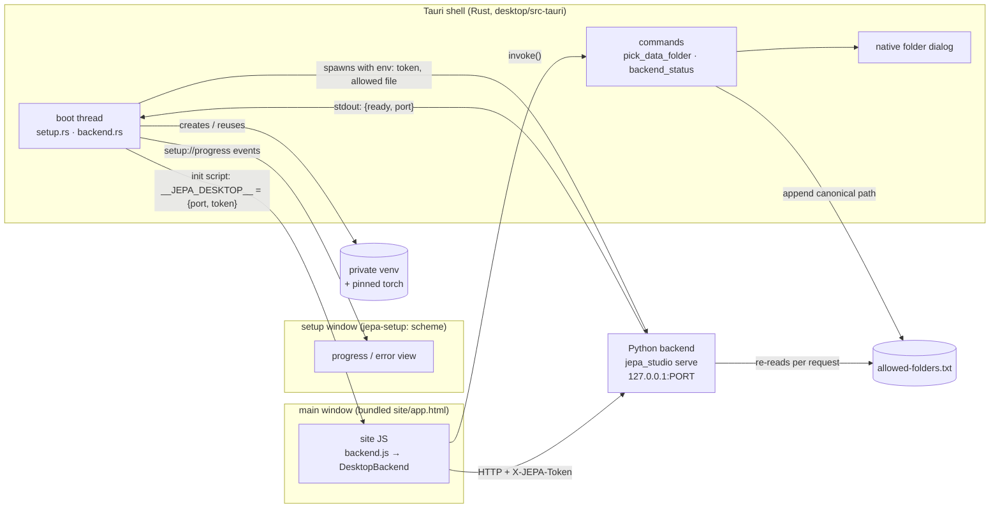

# The desktop app

The desktop app is a thin [Tauri 2](https://tauri.app) shell (`desktop/`) around two things that
already exist in this repo: the static front end in `site/` and the Python backend
`jepa_studio serve` (`jepa_studio/server.py`, API in [api.md](api.md)). The shell's jobs are
small and security-relevant: set up a private Python environment, start the backend on
localhost with a secret token, show the site in a native window that knows the port and token,
let the user grant data folders through a native dialog, and stop the backend when the window
goes away.

## How it fits together



Startup, step by step:

1. The shell opens a small **setup window**. It is served from a private `jepa-setup:` scheme
   compiled into the binary (`desktop/src-tauri/splash/`), not from `site/`.
2. A background thread finds or creates the private Python environment (next section) and
   reports progress to the setup window as `setup://progress` events.
3. It creates a **session token**: 32 bytes from the operating system's random number
   generator, base64url without padding (43 characters).
4. It starts `python -c <watchdog> serve --root <data>/workspace --port 0` with the token and
   the allowed-folders file passed through **environment variables** (`JEPA_STUDIO_TOKEN`,
   `JEPA_STUDIO_ALLOWED_FILE`, plus `PYTHONUNBUFFERED=1` and `PYTHONUTF8=1`), never on the command
   line, so they do not show up in process lists. The watchdog is a few lines of Python that
   exit the backend as soon as the shell's end of its standard input pipe closes, which covers
   the shell crashing or being killed.
5. It waits (up to 180 seconds) for the backend's one stdout line `{"ready": true, "port": N}`.
   If the backend exits first, times out, or announces its own token (meaning it never
   received ours), setup fails with the last lines of `backend.log` in the setup window.
6. It opens the **main window** on the bundled `app.html` with an initialization script that
   runs before any page script and defines
   `window.__JEPA_DESKTOP__ = Object.freeze({port, token})` (read-only, non-configurable, and
   only on the bundled origin). `site/js/backend.js` sees it and switches to the desktop tier.
7. The setup window closes. A watcher checks the backend every 2 seconds and shows an error
   dialog if it stops unexpectedly.
8. Closing the main window (or its web process dying) kills the backend and quits the app.

## First launch: the private Python environment

The app does not ship Python or PyTorch; it builds a private environment the first time it
runs, then reuses it.

1. **Find Python 3.10 or newer.** Windows: the `py` launcher (`py -3.13` down to `py -3.10`,
   then `py -3`), then `python`. macOS and Linux: `python3.13` … `python3.10`, `python3`, then
   `/opt/homebrew/bin/python3`, `/usr/local/bin/python3`, `/usr/bin/python3` (apps started from
   Finder get a minimal `PATH`).
2. **Create a virtual environment** in `<data>/venv` and upgrade pip inside it.
3. **Pick the PyTorch wheel index** from the detected accelerator (pure function
   `torch_choice` in `setup.rs`, unit-tested):

   | Detected | Indexes tried, in order |
   |---|---|
   | macOS | default PyPI (Apple Silicon wheels include Metal Performance Shaders (MPS)) |
   | NVIDIA (`nvidia-smi` works) | `cu130`, `cu128`, `cu126` on `download.pytorch.org/whl/`, keeping only builds the driver can run (from "CUDA Version" in `nvidia-smi`) and that still ship kernels for the oldest GPU (from `--query-gpu=compute_cap`: CUDA 13 needs 7.5+, cu128 needs 7.0+); then `cpu` |
   | AMD ROCm on Linux (`rocminfo` works) | `rocm7.0`, `rocm6.4`, then `cpu` |
   | anything else | `cpu` (avoids gigabytes of CUDA libraries from PyPI) |

   `torch` and `torchvision` (the exact pins from `requirements-desktop.txt`) are installed from
   the first index that has them. `JEPA_STUDIO_TORCH_INDEX=<url>` forces one index.
4. **Install the other pins** from `requirements-desktop.txt` (compiled into the binary) from
   PyPI. The already-installed `torch==X+cuNNN` satisfies the `torch==X` pin.
5. **Install `jepa_studio` itself** with `pip install --no-deps` from the copy bundled with the
   app (`bundle.resources` → `python/jepa_studio`). It is staged to a writable temporary folder
   first because the bundle may be read-only.
6. **Record the result** in `<data>/setup.json`: base Python, venv interpreter, accelerator, the
   index torch came from, the indexes tried, and a stamp (SHA-256 of the requirements file and
   the app version). The next launch skips straight to starting the backend when the stamp
   matches and the interpreter still exists; a new app version or new pins re-runs the install
   (pip only downloads what changed).

The first launch downloads a few GB on CUDA machines. Later launches take seconds, mostly the
backend importing torch.

## Where files live

`<data>` is the app's *local* data folder (on Windows it is under `%LOCALAPPDATA%`, not the
roaming profile, because the venv is large):

| OS | `<data>` |
|---|---|
| Windows | `%LOCALAPPDATA%\io.github.normansrule.jepastudio\` |
| macOS | `~/Library/Application Support/io.github.normansrule.jepastudio/` |
| Linux | `${XDG_DATA_HOME:-~/.local/share}/io.github.normansrule.jepastudio/` |

| Path | What |
|---|---|
| `<data>/venv/` | private Python environment |
| `<data>/setup.json` | what setup chose (accelerator, torch index, interpreter) |
| `<data>/requirements-desktop.txt` | the pins pip installed from |
| `<data>/allowed-folders.txt` | folders you granted, one per line (grants persist across launches; delete a line to revoke) |
| `<data>/workspace/runs/` | training runs, checkpoints, exports |
| `<data>/logs/setup.log` | setup and pip output |
| `<data>/logs/backend.log` | backend stderr/stdout (never contains the token) |

The bundled package sits next to the executable: `jepa-studio.app/Contents/Resources/python/`
on macOS, `python\` in the install folder on Windows, `/usr/lib/jepa-studio/python/` for the
`.deb`.

To reset the app completely, quit it and delete `<data>`.

## Security boundaries

The web view is treated as untrusted content that happens to be ours: it can reach exactly one
local port with a secret, and ask the shell for exactly two things.

* **Token.** Per session, 256 bits from the OS random number generator, passed to Python in the
  environment (not argv), to the page only through the initialization script, and required on
  every request (`X-JEPA-Token`, constant-time compare in `server.py`). It is never logged.
* **Localhost only.** The backend binds `127.0.0.1` on a random port. It rejects requests whose
  `Host` is not `127.0.0.1:<port>` or `localhost:<port>` (DNS rebinding) and whose `Origin`,
  when present, is not the shell's (`tauri://localhost`, `http(s)://tauri.localhost`), so
  another web page in a browser cannot drive it even if it guesses the port.
* **Folder grants.** No command accepts a path from JavaScript. `pick_data_folder` opens the
  native dialog from Rust, canonicalizes the chosen folder (symlinks and `..` resolved),
  refuses names with line breaks or surrounding spaces (they could forge extra lines), and
  appends it once to `allowed-folders.txt`. The backend re-reads that file per request and
  refuses any `data.path` outside the granted folders (HTTP 403).
* **No file system, shell or HTTP plugins.** The shell registers only `tauri-plugin-dialog`, and
  its JavaScript API is not granted either (the Rust side opens the dialog). The dialog crate
  links `tauri-plugin-fs` for a path type, but the fs plugin is never registered, so its
  commands do not exist. `assetProtocol` is off.
* **Capabilities** (`desktop/src-tauri/capabilities/`): the main window gets
  `allow-pick-data-folder` and `allow-backend-status`; the setup window gets
  `core:event:allow-listen`, `core:event:allow-unlisten` and `allow-backend-status`. Nothing
  else, not even `core:default`.
* **Content Security Policy (CSP).** The main window's policy comes from
  `tauri.conf.json` (`app.security.csp`) as a response header:
  `default-src 'self'; script-src 'self'; style-src 'self'; img-src 'self' data: blob:; font-src 'self'; connect-src 'self' http://127.0.0.1:* ipc: http://ipc.localhost; worker-src 'self'; object-src 'none'; base-uri 'none'; form-action 'none'; frame-ancestors 'none'`.
  At runtime the shell narrows `http://127.0.0.1:*` to this session's port, and removes the
  site's own `<meta http-equiv="Content-Security-Policy">` from HTML it serves to the desktop
  window: that meta policy is the web tier's (`connect-src 'self'`), and since browsers enforce
  both a meta and a header policy, leaving it would block every backend call. The website
  itself keeps its meta policy unchanged. `freezePrototype` is on. The setup window has its own
  stricter policy (`default-src 'none'`, scripts and styles from itself only).
* **Navigation.** The main window may only navigate within the bundled site; external links and
  new windows are blocked (there is no shell plugin to open them elsewhere). The injected
  object is only defined on the bundled origin.
* **Lifetime.** The backend dies with the main window, with the app, and (through the stdin
  watchdog) when the shell process dies without cleaning up.

## Calling the shell from the site

`app.withGlobalTauri` is on, so the site can call the two commands without a bundler. Both
exist only in the desktop tier; check `detectTier() === 'desktop'` (or `window.__TAURI__`)
first.

```js
// Opens the native folder picker. Resolves to the canonical absolute path the user picked
// (a string; use it as config.data.path) or null if they cancelled. Rejects with a message
// string if the folder cannot be granted.
const folder = await window.__TAURI__.core.invoke('pick_data_folder');

// Resolves to {phase, message, progress, line, error, port, accelerator, torchIndex, python, logDir}
// phase: "setup" | "starting" | "ready" | "error"
const status = await window.__TAURI__.core.invoke('backend_status');
```

The Data tab does exactly this: in the desktop tier it shows "Use a folder on this computer…"
for images, video clips and CSV time series (`site/js/tabs/data.js`, `useDesktopFolder`), sets
`config.data.kind` / `config.data.path`, and previews samples and views made by the backend.
The web tier keeps its `<input type="file">` path. `tests/test_desktop_tier.py` drives this
flow in a headless browser against the real backend (with `invoke` stubbed), including a
refused folder that was never granted.

The in-app assistant searches the docs bundled with the app: `bundle.resources` copies `docs/`
and `README.md` to `python/docs` and `python/README.md`, and the shell passes
`JEPA_STUDIO_DOCS_DIR=<resources>/python/docs` to the backend.

## Building locally (Ubuntu 22.04+/24.04, or WSL2 with WSLg)

```bash
# system libraries for WebKitGTK and bundling
sudo apt-get update
sudo apt-get install -y libwebkit2gtk-4.1-dev libayatana-appindicator3-dev librsvg2-dev \
  libssl-dev build-essential pkg-config patchelf file python3 python3-venv
# Rust (1.82+) and Node.js (20+)
curl --proto '=https' --tlsv1.2 -sSf https://sh.rustup.rs | sh
# the pinned Tauri CLI (@tauri-apps/cli 2.12.x, same minor as the tauri crate)
cd desktop
npm ci
npx tauri dev            # or: npm i -g @tauri-apps/cli@2 && tauri dev
npx tauri build          # installers in desktop/src-tauri/target/release/bundle/
```

`cargo tauri dev` works too after `cargo install tauri-cli --version "^2.12" --locked`. Plain
`cargo build` / `cargo test` in `desktop/src-tauri` also work (the site is embedded at compile
time from `../../site`).

To skip the venv while developing, point the shell at an interpreter that already has the
requirements and let Python find the repo's package:

```bash
JEPA_STUDIO_PYTHON=$(which python3) PYTHONPATH=$PWD/.. npx tauri dev
```

Debug builds also accept `JEPA_STUDIO_SMOKE=1`: after the main window loads, the shell imports
`js/backend.js` in the page, calls `/api/health` through it, prints `[smoke] OK {...}` or
`[smoke] FAIL ...` on stderr and exits (headless check: `xvfb-run -a target/debug/jepa-studio`).

Continuous integration (`.github/workflows/desktop.yml`) builds Windows, macOS (Apple Silicon)
and Linux installers on every relevant change and publishes a GitHub release with a
`SHA256SUMS.txt` on `v*` tags. The builds are not code-signed yet, so Windows SmartScreen and
macOS Gatekeeper will warn on first open (macOS: right-click → Open).

## Troubleshooting

**"jepa-studio needs Python 3.10 or newer"** – No suitable interpreter was found. Install Python
from python.org (Windows: keep the `py` launcher, or tick "Add python.exe to PATH"), or on
Linux `sudo apt install python3 python3-venv`. On macOS, `brew install python` works too.
Restart the app afterwards.

**"Could not create the virtual environment"** – On Debian/Ubuntu the `venv` module is a
separate package: `sudo apt install python3-venv` (or `python3.12-venv` to match your version).

**PyTorch install fails, or training runs on the CPU despite an NVIDIA GPU** – Check
`<data>/setup.json` for `accelerator` and `torch_index`, and `logs/setup.log` for pip's output.
Usually the driver is older than the CUDA build (update the NVIDIA driver, then delete `<data>/venv`
and `<data>/setup.json` to reinstall), or the pinned torch version is not on that index. Force
an index with `JEPA_STUDIO_TORCH_INDEX=https://download.pytorch.org/whl/cu128` (or `.../cpu`)
and delete `setup.json` to re-run setup. Intel Macs: recent PyTorch releases ship no x86-64
macOS wheels, so the pinned version cannot be installed there.

**"the backend did not report ready within 180 s" / "exited before it was ready"** – Read the
lines shown under the error, or `<data>/logs/backend.log`. Typical causes: a broken venv (delete
`<data>/venv` and `setup.json`), antivirus holding the CUDA DLLs on the first start (try again),
or `JEPA_STUDIO_PYTHON` pointing at an interpreter without the requirements.

**"the backend generated its own token"** – Something in between dropped the environment
variable (for example a wrapper script as `JEPA_STUDIO_PYTHON`). Point it at the real
interpreter.

**The app opens but every action fails with HTTP 401/403/421** – 401: the page is not using the
injected token (reload the window). 403 "origin not allowed": the page is not served from the
bundled origin. 403 "outside the folders you granted": pick the folder again with "Choose
folder…". 421: a proxy or tool rewrote the `Host` header; the app talks to `127.0.0.1` directly,
so check for system-wide proxy settings that capture localhost.

**Port conflicts** – The backend asks the OS for a free port (`--port 0`) on every launch, so
there is nothing to configure; if it cannot bind at all, a firewall or security tool is blocking
loopback sockets for Python.

**The backend stopped unexpectedly** – The dialog shows the last lines of `backend.log`. Out of
memory during training is the common cause: lower the batch size or image size and restart.
